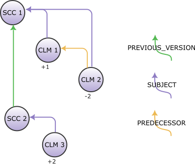

<!---
   Copyright 2025 Ericsson AB.
   For a full list of individual contributors, please see the commit history.

   Licensed under the Apache License, Version 2.0 (the "License");
   you may not use this file except in compliance with the License.
   You may obtain a copy of the License at

       http://www.apache.org/licenses/LICENSE-2.0

   Unless required by applicable law or agreed to in writing, software
   distributed under the License is distributed on an "AS IS" BASIS,
   WITHOUT WARRANTIES OR CONDITIONS OF ANY KIND, either express or implied.
   See the License for the specific language governing permissions and
   limitations under the License.
--->

# Source Change Approval Using Confidence Levels

_Source change approval_ is the process of signaling when a source change has been reviewed and approved according to project requirements. This document describes how to represent source change approval states using [EiffelConfidenceLevelModifiedEvent][CLM] events, providing a standardized way to communicate approval status using the Eiffel protocol.

Source change approval is a critical gate in software development workflows, determining when changes are ready for integration. By modeling approval as confidence levels, teams can create flexible approval workflows that integrate naturally with existing Eiffel-based CI/CD pipelines.

## Confidence Level as Approval State

The [EiffelConfidenceLevelModifiedEvent][CLM] provides a natural way to represent approval states by treating approval as a confidence level in the source change. This approach offers several advantages:

- **Semantic alignment**: Approval represents confidence in the quality and readiness of a change
- **Graduated states**: Can represent progressive approval states (pending, partial, full)
- **Standard tooling**: Existing Eiffel tools understand confidence level events
- **Flexible values**: Supports different approval schemes and requirements

## Ideas for Approval State Representations

To exemplify how the CLM event could be used, we show some alternatives.

### Simple Approval States

The most straightforward approach uses discrete approval states:

```json
{
  "data": {
    "name": "review-approval",
    "value": "APPROVED"
  }
}
```

**Supported values:**
- `PENDING`: Review process initiated but not complete
- `APPROVED`: All required approvals received
- `REJECTED`: Change rejected during review
- `INSUFFICIENT_REVIEWS`: Not enough reviews to meet requirements

### Graduated Confidence Levels

For more nuanced approval processes, use confidence levels that reflect approval strength:

```json
{
  "data": {
    "name": "review-confidence",
    "value": "HIGH"
  }
}
```

**Supported values:**
- `INSUFFICIENT`: Below minimum approval threshold
- `LOW`: Some approvals but below recommended level
- `MEDIUM`: Adequate approvals for most changes
- `HIGH`: Strong approval consensus, suitable for critical changes

### Numeric Confidence Scores

For organizations using approval scoring systems:

```json
{
  "data": {
    "name": "approval-score",
    "value": "85"
  }
}
```

The numeric value can represent:
- Percentage of required approvals received
- Weighted approval score based on reviewer expertise
- Composite score including automated and human reviews

## Event Structure and Linking

### Basic Event Structure

```json
{
  "meta": {
    "type": "EiffelConfidenceLevelModifiedEvent",
    "version": "4.1.0",
    "time": 1234567890,
    "id": "aaaaaaaa-bbbb-5ccc-8ddd-eeeeeeeeeee0"
  },
  "data": {
    "name": "review-approval",
    "value": "APPROVED",
    "issuer": {
      "name": "Review Management System",
      "email": "reviews@example.com"
    }
  },
  "links": [
    {
      "type": "SUBJECT",
      "target": "<source-change-event-id>"
    }
  ]
}
```

### Link Types Involved

#### SUBJECT
Identifies the source change that this confidence level applies to. This link connects the approval event to the relevant [EiffelSourceChangeCreatedEvent][SCC] or [EiffelSourceChangeSubmittedEvent][SCS].

**Required:** Yes  
**Legal sources:** [EiffelConfidenceLevelModifiedEvent][CLM]  
**Legal targets:** [EiffelSourceChangeCreatedEvent][SCC], [EiffelSourceChangeSubmittedEvent][SCS]  
**Multiple allowed:** No  

#### CAUSE
Identifies what triggered this confidence level change. This could link to events representing individual reviews, automated analysis results, or policy changes.

**Required:** No  
**Legal sources:** [EiffelConfidenceLevelModifiedEvent][CLM]  
**Legal targets:** Any  
**Multiple allowed:** Yes  

#### PREDECESSOR
Identifies previous confidence level events that this event supersedes. 
This link indicates which earlier CLM events have been outdated or replaced by the current confidence level assessment.

**Required:** No  
**Legal sources:** [EiffelConfidenceLevelModifiedEvent][CLM]  
**Legal targets:** [EiffelConfidenceLevelModifiedEvent][CLM]  
**Multiple allowed:** Yes

## Override Examples

The following example shows one way to model multiple reviews and their dependence:

1. A developer pushes code for review (`SCC 1`). 
1. The first reviewer gives a `+1` as they think it looks good (`CLM 1`). 
1. The second reviewer spots a serious mistake and gives a `-2` (`CLM 2`). 
1. The developer updates the code and pushes the new code for review (`SCC 2`). 
1. The second reviewer accepts the changes by giving a `+2` (`CLM 3`).



CLM 2 could look like this

```json
{
  "meta": {
    "type": "EiffelConfidenceLevelModifiedEvent",
    "version": "4.1.0",
    "time": 1234567890,
    "id": "aaaaaaaa-bbbb-5ccc-8ddd-eeeeeeeeeee0"
  },
  "data": {
    "name": "review",
    "value": "-2",
    "issuer": {
      "name": "Bob Jones",
      "email": "bob.jones@example.com"
    }
  },
  "links": [
    {
      "type": "SUBJECT",
      "target": "<source-change-1-event-id>"
    },
    {
      "type": "PREDECESSOR",
      "target": "<confidence-level-modified-1-event-id>"
    }
  ]
}
```

### Value of the PREDECESSOR Link

With the `PREDECESSOR` link you can express which events superseded each other 
without relying on conventions that might not be known to all readers. 


## Integration with Pipeline Workflows

### Pre-merge Pipeline Gating

Pipeline activities can wait for appropriate confidence levels before proceeding as shown with this pseudocode:

```json
{
  "pipelineGate": {
    "waitFor": {
      "eventType": "EiffelConfidenceLevelModifiedEvent",
      "conditions": {
        "data.name": "review-approval",
        "data.value": "APPROVED"
      },
      "linkType": "SUBJECT",
      "linkTarget": "source-change-id"
    }
  }
}
```

### Progressive Approval Workflows

Different pipeline stages can trigger based on different confidence levels:

1. **Basic CI triggers** on `review-confidence: LOW`
2. **Integration tests** trigger on `review-confidence: MEDIUM`  
3. **Deployment pipeline** triggers on `review-confidence: HIGH`


<!-- Bookmarks section -->
[ActT]: ../eiffel-vocabulary/EiffelActivityTriggeredEvent.md
[ActF]: ../eiffel-vocabulary/EiffelActivityFinishedEvent.md
[CLM]: ../eiffel-vocabulary/EiffelConfidenceLevelModifiedEvent.md
[SCC]: ../eiffel-vocabulary/EiffelSourceChangeCreatedEvent.md
[SCS]: ../eiffel-vocabulary/EiffelSourceChangeSubmittedEvent.md